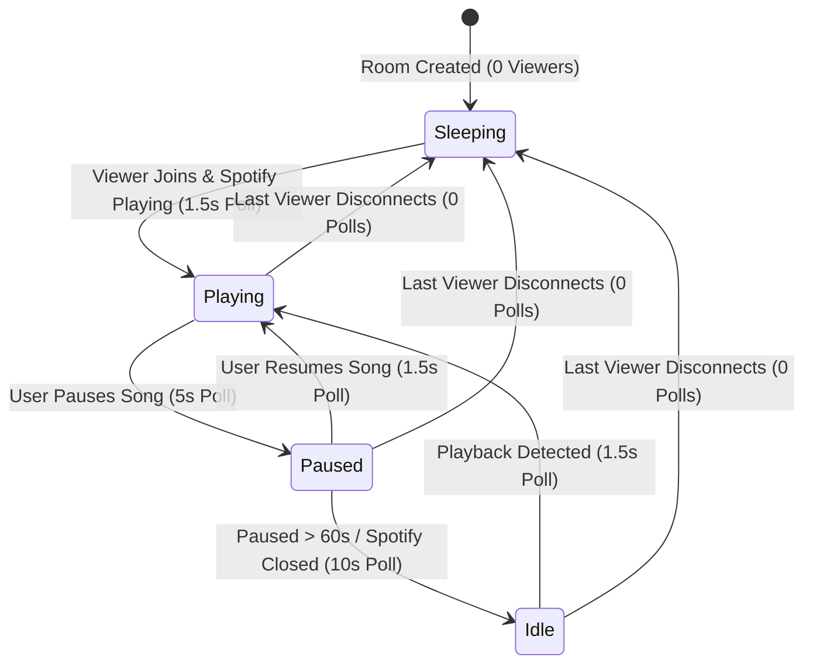

# Adaptive Polling Engine

Spotify does not provide an outgoing WebSocket webhook for user playback changes. To provide responsive real-time lyric tracking while strictly adhering to Spotify's API rate limits, Cantus employs an **Adaptive Polling Engine**.

---

## State Machine Architecture

The background poller (`ActiveUsersPlaybackMonitor`) monitors connected SignalR rooms and dynamically shifts polling frequencies based on player activity:

---

## Polling Cadence Profiles

| State | Interval | Rationale | API Impact |
| :--- | :---: | :--- | :--- |
| **Active Playing** | `1,500ms` | Captures track transitions, scrubbing, and precise progress positions. | ~0.67 req/sec per active listener. |
| **Paused** | `5,000ms` | Detects when the user resumes playback without unnecessarily burning quota. | 0.20 req/sec per active listener. |
| **Idle / Inactive** | `10,000ms` | Spotify app closed or inactive for extended periods. | 0.10 req/sec per active listener. |
| **Sleeping** | `0ms` (Halted) | No active viewers are connected to the room. | **0 req/sec** (Zero quota usage). |

---

## Zero-Viewer Sleep Optimization

When you close the browser tab or power down your TV display:
1. The client disconnects or switches user subscriptions in SignalR.
2. The server's `SessionRegistry` decrements the active viewer count for that Spotify user.
3. When the viewer count reaches `0`, background polling for that Spotify account is immediately suspended.
4. When you open the display again, the poller wakes up instantly.

---

## Token Renewal Coordination

The adaptive poller also supervises token lifecycles:
- Spotify access tokens expire every 60 minutes.
- When an active session's access token is within 5 minutes of expiration, the poller automatically triggers an OAuth refresh using the encrypted refresh token stored in SQLite.
- Playback tracking continues uninterrupted without user intervention or dropped frames.
