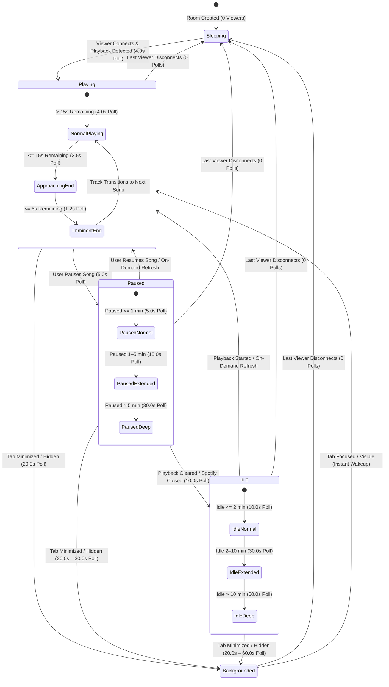

# Adaptive Polling Engine

Spotify does not provide an outgoing WebSocket webhook for user playback changes. To provide responsive real-time lyric tracking while strictly adhering to Spotify's API rate limits, Cantus employs an **Adaptive Polling Engine** (`ActiveUsersPlaybackMonitor`).

The engine dynamically schedules per-user polling intervals based on player activity, remaining track duration, browser tab visibility, and client interaction.

---

## State Machine Architecture

The background worker evaluates connected SignalR clients and playback snapshots on every tick, scheduling the next poll time independently for each active Spotify user:



---

## Polling Cadence Profiles

| State | Interval | Trigger Condition | Rationale & API Quota Impact |
| :--- | :---: | :--- | :--- |
| **Imminent Track End** | `1,200ms` | Playing & remaining track $\le$ 5,000ms | Catches the track boundary almost instantly so lyrics transition on beat (~0.83 req/s). |
| **Approaching Track End** | `2,500ms` | Playing & remaining track $\le$ 15,000ms | Prepares for track end and detects upcoming fade-outs (0.40 req/s). |
| **Active Playing (Baseline)**| `4,000ms` | Playing & remaining track $>$ 15,000ms | Steady-state tracking; client interpolation smoothly handles lyric scrolling between polls (0.25 req/s). |
| **Paused (Initial)** | `5,000ms` | Paused duration $\le$ 1 minute | Fast detection if the user pauses briefly to speak or answer a call (0.20 req/s). |
| **Paused (Extended)** | `15,000ms` | Paused duration 1–5 minutes | Intermediate backoff for short breaks (0.067 req/s). |
| **Paused (Deep)** | `30,000ms` | Paused duration $>$ 5 minutes | Deep conservation when playback is halted long-term (0.033 req/s). |
| **Idle (Initial)** | `10,000ms` | No active playback $\le$ 2 minutes | Detects when user opens Spotify and queues a track (0.10 req/s). |
| **Idle (Extended)** | `30,000ms` | No active playback 2–10 minutes | Intermediate backoff when Spotify is closed or idle (0.033 req/s). |
| **Idle (Deep)** | `60,000ms` | No active playback $>$ 10 minutes | Maximum power/quota savings while keeping room connection alive (0.016 req/s). |
| **Background Throttled** | `20,000ms` | All connected viewer tabs are hidden / minimized | Drastically reduces polling while user is not looking at the lyrics display (0.05 req/s). |
| **Sleeping** | `0ms` (Halted) | Zero connected clients across all displays | Complete suspension: **0 req/s** (zero quota consumption). |

---

## Dynamic End-of-Track Acceleration

A major challenge with polling-based Spotify synchronization is catching track transitions without wasting requests during long tracks.

Cantus solves this with **Horizon Acceleration**:
1. When a song has more than 15 seconds remaining, Cantus polls every `4,000ms`. The client's Phase-Locked Loop (PLL) interpolator keeps lyrics scrolling perfectly at 60 FPS between updates.
2. When remaining duration drops below `15,000ms` (`ApproachingEndThresholdMs`), the interval tightens to `2,500ms` (`ApproachingEndPollIntervalMs`).
3. When remaining duration drops below `5,000ms` (`ImminentEndThresholdMs`), the interval tightens to `1,200ms` (`ImminentEndPollIntervalMs`).
4. Once the track finishes and transitions, the new track's lyrics and offsets are resolved and broadcast immediately, and cadence resets to the baseline `4,000ms`.

---

## Client Visibility Tracking

In WebAssembly and modern browsers, Cantus monitors tab visibility using the standard Page Visibility API (`WasmInterop.cs` / `document.visibilitychange`):

- When you switch browser tabs or minimize the window, the client invokes `ReportClientVisibility(false)` on `PlaybackHub`.
- When all active client connections for a user are hidden, the server immediately throttles polling to `BackgroundPollIntervalMs` (`20,000ms` by default) or the deeper backoff cadence.
- The moment you focus or switch back to the tab, the client sends `ReportClientVisibility(true)`. The server immediately triggers an instant poll wakeup without waiting for the scheduled background interval to finish.

---

## On-Demand Playback Refresh

Rather than waiting for the next polling cycle when resuming playback:
1. When a user clicks **Resume**, selects a track, or switches back into the window, the client invokes `RefreshPlayback()` on the SignalR hub.
2. The server calls `IPlaybackSessionRegistry.RequestUserActivity(userId)`, resetting `_nextPollUtc[userId]` to immediately runnable.
3. The poller cancels its internal delay via `_wakeCts.Cancel()`, awakening the background loop instantly and polling Spotify within milliseconds.

---

## Rate Limit Backoff (HTTP 429) & Error Handling

If Spotify responds with `APITooManyRequestsException` (HTTP 429):
1. The engine parses the `Retry-After` header (defaulting to 60 seconds if unspecified).
2. Sets `_rateLimitUntilUtc` to halt all outbound Spotify API calls until the cooldown expires.
3. Broadcasts updated runtime diagnostics to all clients via `ReceiveDiagnostics`:
   ```json
   {
     "pollerStatus": "Rate Limited (00:45)",
     "activePollIntervalMs": 10000
   }
   ```
4. Displays the rate-limit countdown banner in the client UI so listeners know why updates are paused.
5. Automatically resumes normal polling once the retry window elapses.

---

## Zero-Viewer Sleep Optimization

When you close the browser tab or turn off your kiosk display:
1. The client disconnects or switches user subscriptions in SignalR.
2. The server's `PlaybackSessionRegistry` decrements the active viewer count for that user.
3. When viewer count reaches `0`, background polling for that Spotify account is suspended.
4. When you open the display again, the poller wakes up instantly via `OnClientsConnected`.

---

## Token Renewal Coordination

The adaptive poller supervises Spotify access token expiration:
- Spotify access tokens expire every 60 minutes (`ExpiresIn = 3600`).
- If an API call returns `401 Unauthorized` or the token is expiring, `SpotifyAuthService.RefreshTokenAsync` automatically exchanges the encrypted SQLite refresh token for a fresh access token.
- If the token refresh encounters a rate limit or transient error, the poller logs a structured warning and attempts recovery on the next scheduled tick without dropping the client connection.

