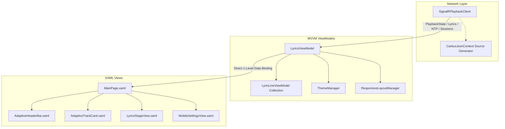

# Client & Uno Platform Architecture

The Cantus client is built with **Uno Platform**, enabling a unified C# and XAML codebase to run natively across Linux (Skia/X11), Windows (WinUI 3), and modern web browsers via WebAssembly.

---

## Client MVVM Pattern

The client architecture cleanly isolates presentation logic from real-time network communications:

---

## Core Client Components

### 1. `SignalRPlaybackClient`
- Manages the WebSocket lifecycle: automatic reconnect with exponential backoff, clock synchronization, and dispatching incoming payload events.
- Utilizes `CantusJsonContext` (`JsonSerializerContext`) for AOT / trimmed WebAssembly source-generated JSON deserialization, ensuring zero reflection overhead and maximum runtime reliability.
- Runs the 4-timestamp NTP clock synchronization loop.

### 2. `LyricsViewModel`
- Coordinates overall state: active playback progress, song metadata, lyrics line collection, authorized Spotify sessions, and instrumental breaks.
- Provides flattened 1-level direct visual properties (`BackgroundBrush`, `SurfaceCardBrush`, `NoSessionsVisibility`, `HasSessionsVisibility`, `CurrentBreakpoint`) ensuring thread-safe, compile-time verified XAML `{x:Bind}` execution across all platforms.
- Drives the 60 FPS animation tick loop (`OnTick`), evaluating which line should be marked active based on the synchronized clock.

### 3. `LyricLineViewModel`
- Represents an individual lyric line with observable properties for:
  - `IsActive`: Whether this line is currently being sung.
  - `IsPast`: Whether this line has already finished.
  - `LineBrush`, `FontSize`, `FontWeight`, and `Opacity`: Visual styling dynamically driven by theme and active state.

### 4. `ThemeManager` & `ResponsiveLayoutManager`
- `ThemeManager` extracts dynamic palettes from album artwork bytes and provides WCAG-compliant high-contrast theme brushes.
- `ResponsiveLayoutManager` dynamically classifies viewports into `Compact`, `Medium`, `Expanded`, `LargeDesktop`, and `FullscreenTv` breakpoints.

---

## Target Runtime Matrix

| Platform Target | Runtime Engine | UI Backend | Packaging |
| :--- | :--- | :--- | :--- |
| **WebAssembly (WASM)** | .NET 10 WebAssembly | Uno DOM/HTML Engine | Embedded in Docker container (`wwwroot`). |
| **Linux Desktop / Raspberry Pi** | .NET 10 CoreCLR | Skia / X11 / Wayland | Standalone native binary / Flatpak. |
| **Windows Desktop** | .NET 10 CoreCLR | WinUI 3 / Windows App SDK | MSIX / Standalone `.exe`. |
