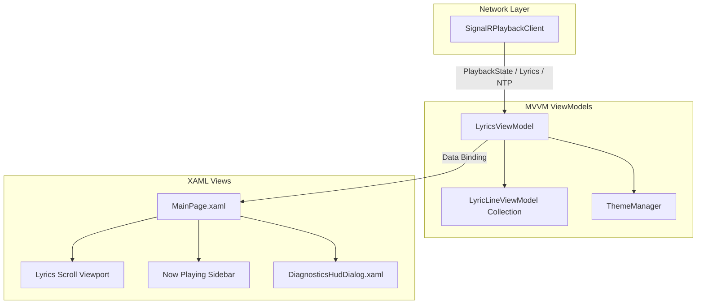

# Client & Uno Platform Architecture

The Cantus client is built with **Uno Platform**, enabling a unified C# and XAML codebase to run natively across Linux (Skia/X11), Windows (WinUI 3), and modern web browsers via WebAssembly.

---

## Client MVVM Pattern

The client architecture cleanly isolates presentation logic from real-time network communications:

---

## Core Client Components

### 1. `SignalRPlaybackClient`
- Manages the WebSocket lifecycle: automatic reconnect with exponential backoff, joining/leaving rooms, and dispatching incoming payload events.
- Runs the 4-timestamp NTP clock synchronization loop.

### 2. `LyricsViewModel`
- Coordinates overall state: active playback progress, song metadata, lyrics line collection, and instrumental breaks.
- Drives the 60 FPS animation tick loop (`OnTick`), evaluating which line should be marked active based on the synchronized clock.

### 3. `LyricLineViewModel`
- Represents an individual lyric line with observable properties for:
  - `IsActive`: Whether this line is currently being sung.
  - `IsPassed`: Whether this line has already finished.
  - `Opacity`, `Scale`, and `Color`: Visual styling dynamically driven by theme state.

### 4. `ThemeManager`
- Extracts dynamic palettes from album artwork bytes using `ColorExtractionHelper`.
- Computes WCAG-compliant high-contrast accent colors and broadcasts palette changes to all UI bindings.

---

## Target Runtime Matrix

| Platform Target | Runtime Engine | UI Backend | Packaging |
| :--- | :--- | :--- | :--- |
| **WebAssembly (WASM)** | .NET 9 WebAssembly | Canvas / DOM / WebGL | Embedded in Docker container. |
| **Linux Desktop / Raspberry Pi** | .NET 9 CoreCLR | Skia / X11 / Wayland | Standalone native binary / Flatpak. |
| **Windows Desktop** | .NET 9 CoreCLR | WinUI 3 / Windows App SDK | MSIX / Standalone `.exe`. |
