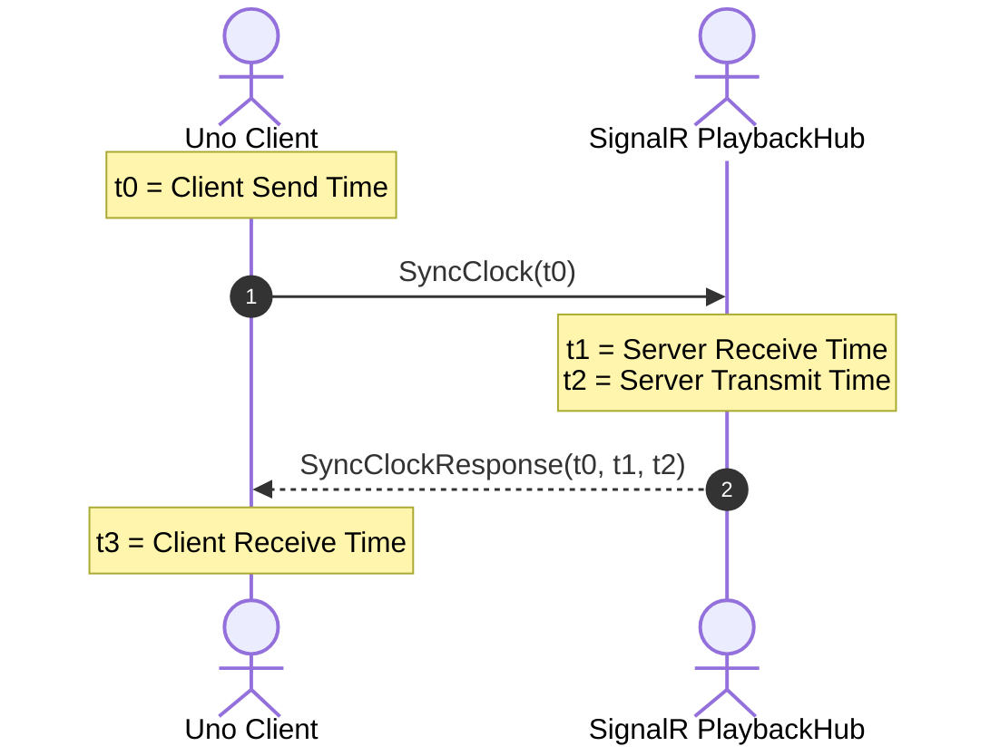
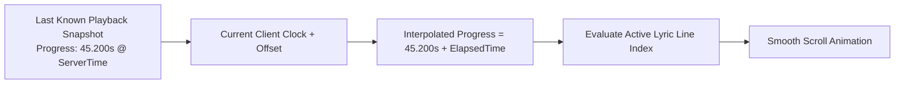

# NTP Clock Synchronization

Synchronized lyrics require timing precision within tens of milliseconds. Because browser and device system clocks can drift significantly relative to the server and audio source, Cantus implements an **NTP-style 4-timestamp clock synchronization protocol** over SignalR.

---

## Why Clock Synchronization Matters

When Spotify reports that a track is at progress `01:45.320` at timestamp $T$, the client must accurately render the exact millisecond position as time elapses.

Without clock synchronization:
- Client system clock drift creates noticeable desynchronization (lyrics advancing too fast or too slow).
- Variable network round-trip latency introduces jitter when playback updates arrive.

---

## The 4-Timestamp Synchronization Algorithm

Cantus uses the standard Network Time Protocol (NTP) round-trip model:

1. **Client Send ($t_0$)**: Client records local high-resolution timestamp ($t_0$) and sends `SyncClock(t0)` to the hub.
2. **Server Receive ($t_1$)**: Server captures timestamp ($t_1$) upon receiving the frame.
3. **Server Transmit ($t_2$)**: Server captures timestamp ($t_2$) as it transmits the response payload containing $(t_0, t_1, t_2)$.
4. **Client Receive ($t_3$)**: Client captures timestamp ($t_3$) when the response arrives.

---

## Offset and Jitter Filtering

From these four timestamps, Cantus calculates two core metrics:

1. **Round-Trip Delay ($\delta$)**:

    $$\delta = (t_3 - t_0) - (t_2 - t_1)$$

    Measures pure network transit time excluding server processing overhead.

2. **Clock Offset ($\theta$)**:

    $$\theta = \frac{(t_1 - t_0) + (t_2 - t_3)}{2}$$

    Represents how much the client clock leads or lags behind the server clock.

### Moving Average Jitter Filter

- When the client connects, it performs a burst of 5 initial sync samples.
- Samples with abnormally high round-trip latency (spikes/outliers) are discarded.
- The remaining samples are averaged to compute a stable base clock offset $\theta_{\text{stable}}$.
- Periodic background syncs occur every 60 seconds to track long-term clock drift smoothly without visual jumps.

---

## Continuous Playback Interpolation

Once the offset is known, the client runs a 60 FPS UI animation timer:

This ensures fluid, 60fps lyric scrolling even when Spotify polling updates arrive every 500ms over the network.
