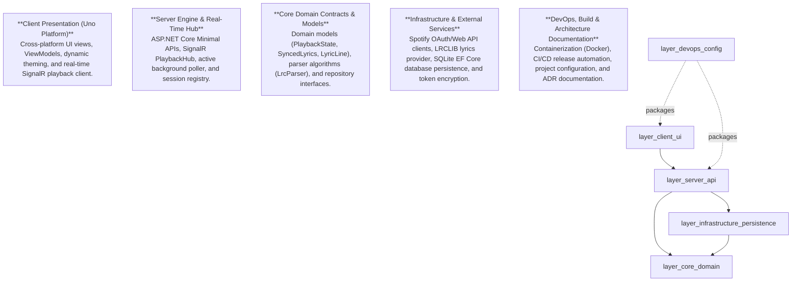

# System Architecture Overview

**Project**: Cantus

**Description**: Cantus is a self-hosted, multi-room synchronized lyrics display platform integrated with Spotify playback via ASP.NET Core, SignalR, and Uno Platform.

**Frameworks**: ASP.NET Core, Entity Framework Core, SignalR, Uno Platform, Docker, Docker Compose, GitHub Actions

Cantus is built upon a modular **5-Layer Architecture** designed for high-concurrency real-time streaming, sub-millisecond clock synchronization, and cross-platform desktop/browser lyric rendering.

## Architectural Layers

## Layer Summary

| Layer | Description | Components | Page Link |
| :--- | :--- | :---: | :--- |
| **Client Presentation (Uno Platform)** | Cross-platform UI views, ViewModels, dynamic theming, and real-time SignalR playback client. | 48 | [Client Presentation (Uno Platform)](client.md) |
| **Server Engine & Real-Time Hub** | ASP.NET Core Minimal APIs, SignalR PlaybackHub, active background poller, and session registry. | 49 | [Server Engine & Real-Time Hub](server.md) |
| **Core Domain Contracts & Models** | Domain models (PlaybackState, SyncedLyrics, LyricLine), parser algorithms (LrcParser), and repository interfaces. | 20 | [Core Domain Contracts & Models](core.md) |
| **Infrastructure & External Services** | Spotify OAuth/Web API clients, LRCLIB lyrics provider, SQLite EF Core database persistence, and token encryption. | 64 | [Infrastructure & External Services](infrastructure.md) |
| **DevOps & Release Packaging** | Containerization (Docker), CI/CD release automation, project configuration, and ADR documentation. | 26 | [DevOps & Release Packaging](../reference/docker.md) |

## Knowledge Graph Statistics

- **Total Extracted Nodes**: 207
- **Total Relationships / Edges**: 156
- **Architectural Layers**: 5
- **Last Analysis Timestamp**: `2026-08-23T15:24:35.958Z`
