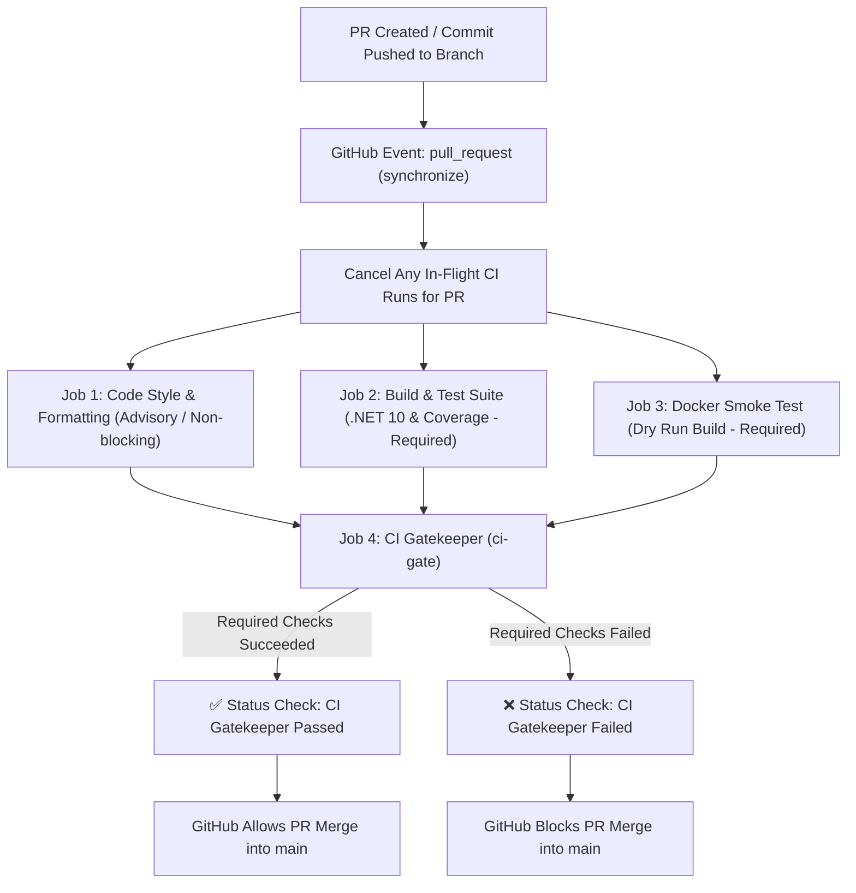

# GitHub Actions CI & Branch Protection Setup

This document provides step-by-step instructions for configuring **GitHub Branch Protection Rules** and **Repository Rulesets** to enforce automated CI testing on all Pull Requests targeting `main`.

---

## 1. Overview of Cantus CI Architecture

The Cantus continuous integration pipeline ([`.github/workflows/ci.yml`](file:///.github/workflows/ci.yml)) is designed for speed, cross-platform coverage, and strict merge verification:

| Trigger Event | Execution Strategy | Target Environments |
| :--- | :--- | :--- |
| **Pull Request to `main`** (`opened`, `synchronize`, `reopened`, `ready_for_review`) | **Fast Single Runner** (~1–2 min) | `ubuntu-latest` (Linux) |
| **Commit Pushed to `main`** (`push`) | **Cross-Platform Matrix** | `ubuntu-latest`, `windows-latest`, `macos-latest` |
| **Manual Dispatch** (`workflow_dispatch`) | Configured Matrix | `ubuntu-latest` (or full matrix) |



---

## 2. Automated PR Triggers & In-Flight Cancellation

### Automatic Builds on Every Push
Whenever a developer opens a Pull Request or pushes subsequent commits to a branch with an active PR targeting `main`, GitHub Actions triggers the `synchronize` event automatically.

### In-Flight Run Auto-Cancellation
To avoid wasting CI runner minutes and prevent outdated runs from finishing after new code has already been pushed, `ci.yml` defines:

```yaml
concurrency:
  group: ${{ github.workflow }}-${{ github.event.pull_request.number || github.ref }}
  cancel-in-progress: true
```

When commit `B` is pushed while commit `A` is still building, GitHub immediately cancels run `A` and prioritizes run `B`.

---

## 3. The Gatekeeper Pattern (`ci-gate`)

Because Cantus runs a dynamic matrix (1 OS on PRs, 3 OSes on `main` push) and multiple parallel validation jobs (`format-check`, `build-and-test`, `docker-smoke-test`), GitHub Branch Protection should **not** bind directly to individual matrix job names. 

Instead, `ci.yml` exposes a single unified aggregator job:

```yaml
ci-gate:
  name: CI Gatekeeper (All Checks Passed)
  runs-on: ubuntu-latest
  needs: [format-check, build-and-test, docker-smoke-test]
  if: always()
```

In GitHub repository settings, you only need to require **`CI Gatekeeper (All Checks Passed)`** as the required status check.

---

## 4. Configuring Branch Protection on GitHub

### Method A: Using GitHub Repository Rulesets (Recommended)

1. On GitHub, navigate to **Settings** > **Rules** > **Rulesets**.
2. Click **New ruleset** > **New branch ruleset**.
3. Configure the ruleset parameters:
   - **Ruleset Name**: `Main Branch Protection`
   - **Enforcement status**: `Active`
   - **Bypass list**: (Leave empty or set to Repository Admin only).
4. Under **Target branches**, click **Add target** > **Include default branch** (or select `main`).
5. Under **Branch rules**, enable the following options:
   - [x] **Restrict deletions**
   - [x] **Block force pushes**
   - [x] **Require a pull request before merging**:
     - *Required approvals*: `1` (or desired minimum)
     - *Dismiss stale pull request approvals when new commits are pushed*: **Enabled**
     - *Require review from Code Owners*: Optional
   - [x] **Require status checks to pass before merging**:
     - *Require branches to be up to date before merging*: **Enabled** (Strict CI enforcement — ensures the PR branch is tested against the tip of `main`).
     - Click **+ Add checks** and search for:
       ```
       CI Gatekeeper (All Checks Passed)
       ```
6. Click **Create** / **Save changes**.

---

### Method B: Using Classic Branch Protection Rules

If your organization uses classic Branch Protection:

1. Navigate to **Settings** > **Branches**.
2. Under **Branch protection rules**, click **Add rule**.
3. Set **Branch name pattern** to `main`.
4. Enable the following settings:
   - [x] **Require a pull request before merging**
     - [x] **Dismiss stale pull request approvals when new commits are pushed**
   - [x] **Require status checks to pass before merging**
     - [x] **Require branches to be up to date before merging**
     - In the search box, search and check:
       ```
       CI Gatekeeper (All Checks Passed)
       ```
   - [x] **Do not allow bypassing the above settings** (optional, enforces for admins too)
5. Click **Create** / **Save changes**.

---

## 5. Local Pre-PR Verification

Before opening or pushing to a PR, developers can run the full verification pipeline locally:

```bash
# 1. Format code according to solution ruleset (optional / advisory)
dotnet format

# 2. Build Release solution
dotnet build Cantus.slnx --configuration Release

# 3. Execute all unit and integration test suites with coverage
dotnet test Cantus.slnx --configuration Release --no-build --logger "trx;LogFileName=test_results.trx" --collect:"XPlat Code Coverage"

# 4. Dry-run Docker container build
docker build -t cantus:ci-test .
```
