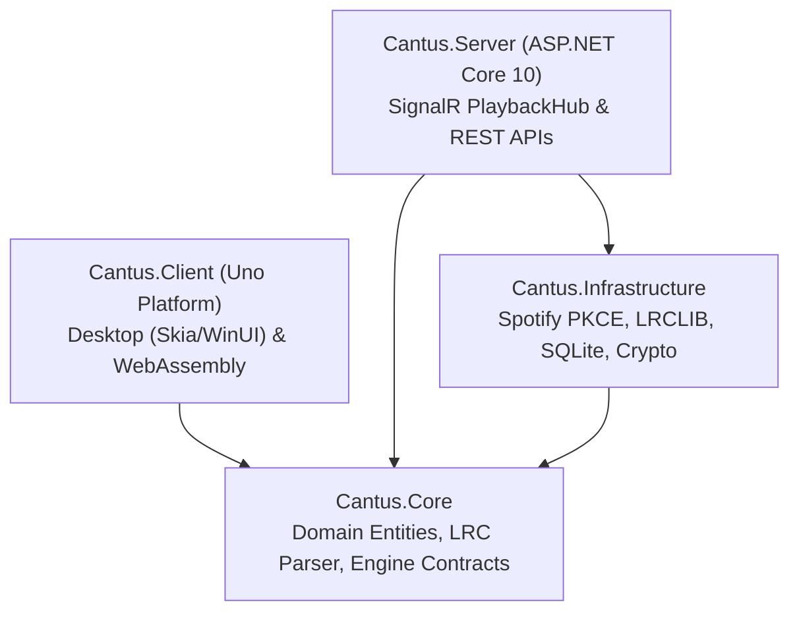

# Contributing to Cantus

Thank you for your interest in contributing to Cantus! We welcome contributions of all kinds—from reporting bugs and improving documentation to submitting bug fixes and proposing new features.

---

## Code of Conduct

Cantus is an open-source project that thrives on respectful, constructive collaboration. Please ensure that all interactions across discussions, issues, and pull requests remain professional and welcoming to developers of all backgrounds.

---

## Ways to Contribute

You can contribute to Cantus in several ways:

- **Bug Reports**: Open an issue if you discover a timing bug, rendering defect, or crash.
- **Feature Requests**: Share ideas for new UI visualizers, additional lyrics providers, or platform targets.
- **Code Contributions**: Submit pull requests for bug fixes, performance optimizations, or new capabilities.
- **Documentation**: Help improve guides, clarify setup steps, or fix typos.

---

## Development Setup & Prerequisites

### Prerequisites

To build and run Cantus locally, ensure you have the following installed:

1. **.NET 10 SDK** (`v10.0.100` or higher):
   ```bash
   dotnet --version
   ```
2. **Uno Platform WebAssembly Workload** (if developing for the Web client):
   ```bash
   dotnet workload install wasm-tools
   ```
3. **Spotify Developer Account** (Free):
   - Create a free developer application at [developer.spotify.com/dashboard](https://developer.spotify.com/dashboard) to obtain a **Client ID**.
   - Add `http://localhost:5000/api/auth/spotify/callback` and `http://127.0.0.1:5000/api/auth/spotify/callback` to your Spotify App's **Redirect URIs**.
4. **Docker** (Optional): For running containerized tests or smoke tests.

### Getting the Code

1. Fork the [Cantus repository](https://github.com/jav76/Cantus) on GitHub.
2. Clone your fork locally:
   ```bash
   git clone https://github.com/<your-username>/Cantus.git
   cd Cantus
   ```
3. Create a descriptive feature branch:
   ```bash
   git checkout -b feature/my-new-feature
   ```

### Local Environment Configuration

Copy the example environment configuration:

```bash
cp .env.example .env
```

Edit `.env` to include your Spotify Client ID:

```ini
SPOTIFY_CLIENT_ID=your_32_character_client_id
CANTUS_HOST_URL=http://localhost:5000
```

---

## Solution Structure & Architecture

Cantus is structured following **Clean Architecture** across four primary solution projects in `Cantus.slnx`:



- **`src/Cantus.Core`**: Pure .NET standard domain models (`PlaybackState`, `SyncedLyrics`, `LyricLine`), `LrcParser`, and interface definitions. Zero external framework dependencies.
- **`src/Cantus.Infrastructure`**: Implementation of Spotify Web API client, LRCLIB integration, SQLite caching (`CantusDbContext`), and Data Protection encryption.
- **`src/Cantus.Server`**: ASP.NET Core application hosting the SignalR `PlaybackHub`, background `ActiveUsersPlaybackMonitor`, and Minimal API endpoints.
- **`src/Cantus.Client`**: Cross-platform MVVM client targeting Desktop (Linux Skia, Windows WinUI 3) and WebAssembly.

---

## Building and Running Locally

### 1. Build the Entire Solution

```bash
dotnet build Cantus.slnx
```

### 2. Run the ASP.NET Core Server

Start the backend server on `http://localhost:5000`:

```bash
dotnet run --project src/Cantus.Server
```

To enable detailed debug or trace logs in the terminal:

```bash
dotnet run --project src/Cantus.Server -- --log-configuration debug
```

### 3. Run the Desktop Client

Launch the Uno Platform Skia desktop window:

```bash
dotnet run --project src/Cantus.Client/Cantus.Client/Cantus.Client.csproj -f net10.0-desktop
```

### 4. Run the WebAssembly Client

To build and serve the WebAssembly client through the ASP.NET Core server:

```bash
# Publish WASM assets
dotnet publish src/Cantus.Client/Cantus.Client/Cantus.Client.csproj -f net10.0-browserwasm -c Release -o ./src/Cantus.Server/wwwroot

# Start server and navigate to http://localhost:5000
dotnet run --project src/Cantus.Server
```

---

## Running Automated Tests

Before opening a pull request, ensure all unit and integration test suites pass:

```bash
# Run all tests
dotnet test Cantus.slnx

# Run tests with detailed console logger
dotnet test Cantus.slnx --logger "console;verbosity=normal"
```

Unit and integration tests reside in `tests/`:
- `tests/Cantus.Core.Tests`: LRC parser, time calculations, domain model logic.
- `tests/Cantus.Infrastructure.Tests`: Caching layers, token encryption, SQLite persistence.
- `tests/Cantus.Server.Tests`: SignalR hub broadcasting, REST API endpoints, adaptive poller state transitions.

---

## Coding Standards & Style Conventions

Cantus follows strict C# code quality guidelines. Please keep the following rules in mind:

### 1. Explicit Types over `var`
Do not use `var` for local variable declarations. Always use the explicit type:
```csharp
// Correct
string trackTitle = "Never Gonna Give You Up";
int durationMs = 213000;
List<LyricLine> lines = new();

// Avoid
var trackTitle = "Never Gonna Give You Up";
```

### 2. Target-Typed `new()`
When the explicit type is declared on the left-hand side, use target-typed `new()`:
```csharp
// Correct
Dictionary<string, CachedTrack> cache = new();
PlaybackState state = new(trackId, progressMs);

// Avoid
Dictionary<string, CachedTrack> cache = new Dictionary<string, CachedTrack>();
```

### 3. File-Scoped Namespaces
Always use file-scoped namespace declarations:
```csharp
namespace Cantus.Core.Models;
```

### 4. Allman Bracing Style
Place opening braces `{` on their own line:
```csharp
public void UpdateProgress(long progressMs)
{
    if (progressMs < 0)
    {
        return;
    }
}
```

### 5. Structured Logging
Never use string interpolation inside `ILogger` calls. Use semantic message templates:
```csharp
// Correct
_logger.LogInformation("User {UserId} joined room {RoomCode}", userId, roomCode);

// Avoid
_logger.LogInformation($"User {userId} joined room {roomCode}");
```

### 6. Code Formatting
Format your code before committing using `dotnet format`:
```bash
dotnet format Cantus.slnx
```

---

## Submitting a Pull Request (PR)

### PR Checklist

Before submitting your pull request, verify that:

- [ ] Code builds without errors or warnings (`dotnet build Cantus.slnx --configuration Release`).
- [ ] All unit and integration tests pass (`dotnet test Cantus.slnx`).
- [ ] Code conforms to repository formatting standards (`dotnet format`).
- [ ] New functionality or bug fixes include corresponding unit or integration tests.
- [ ] Commit messages and PR titles are clear, descriptive, and follow conventional commit formats (e.g. `feat: ...`, `fix: ...`, `docs: ...`).

### Opening the PR

1. Push your branch to your GitHub fork:
   ```bash
   git push origin feature/my-new-feature
   ```
2. Navigate to [github.com/jav76/Cantus](https://github.com/jav76/Cantus) and click **Compare & pull request**.
3. Fill out the PR template with a clear explanation of what changed, why, and how it was tested.
4. If your PR resolves an existing issue, link it in the description (e.g. `Closes #12`).
5. Automated CI checks will validate formatting, compilation, and test execution.

---

## Reporting Issues

If you find a bug or experience unexpected behavior:

1. Check existing [GitHub Issues](https://github.com/jav76/Cantus/issues) to see if the issue has already been reported.
2. Open a new issue with:
   - A clear, descriptive title.
   - Exact steps to reproduce the behavior.
   - Expected vs. actual behavior.
   - Relevant environment details (OS, browser/client type, Docker setup).
   - Server or client logs (use `--log-configuration debug` or open the Diagnostics HUD by pressing <kbd>D</kbd> in the client).
