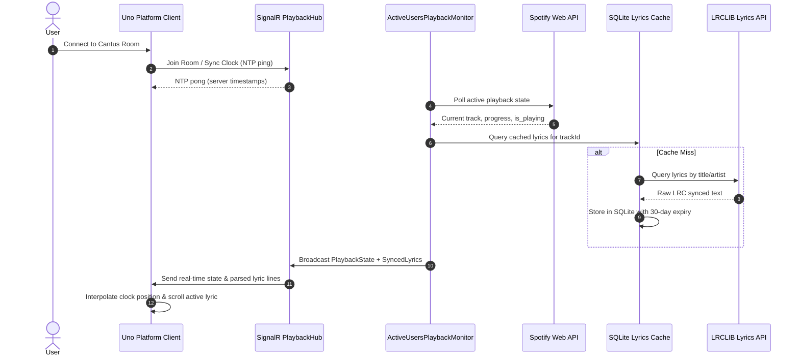

# Business Domain Flows

Cantus models core platform operations as structured **Domain Flows**. Each flow maps end-to-end business logic, trigger conditions, step sequences, and exact source code locations.

## Domain Map

| Domain | Summary | Key Entities | Business Flows |
| :--- | :--- | :--- | :--- |
| **[Spotify Authentication & Session Management](spotify-pkce-login.md)** | Handles Spotify OAuth 2.0 PKCE authentication flows, secure token encryption at rest via ASP.NET Core Data Protection, automated token renewal cycles, and user session persistence. | `UserSession`, `SpotifyAuthTokens`, `PKCEChallenge` | [View Flow](spotify-pkce-login.md) |
| **[Real-Time Playback Monitoring & Polling](playback-sync.md)** | Manages intelligent adaptive background polling of active Spotify player instances, tracks track transitions and play/pause states, and coordinates broadcasts across SignalR clients. | `PlaybackState`, `TrackInfo`, `UserPlaybackSnapshot` | [View Flow](playback-sync.md) |
| **[Synchronized Lyrics Retrieval & Caching](lyrics-caching.md)** | Orchestrates multi-tiered lyrics retrieval with local SQLite caching, LRCLIB integration with title/artist fuzzy matching, LRC parsing, and per-track latency calibration. | `SyncedLyrics`, `LyricLine`, `CachedLyricsEntity`, `TrackOffset` | [View Flow](lyrics-caching.md) |
| **[Client Clock Synchronization & Dynamic Rendering](ntp-interpolation.md)** | Provides continuous NTP-based sub-millisecond clock synchronization, playback position interpolation, dynamic color scheme extraction from album art, and smooth lyric UI rendering. | `NtpSample`, `AppTheme`, `LyricLineViewModel`, `DiagnosticsDto` | [View Flow](ntp-interpolation.md) |

## End-to-End System Interaction

