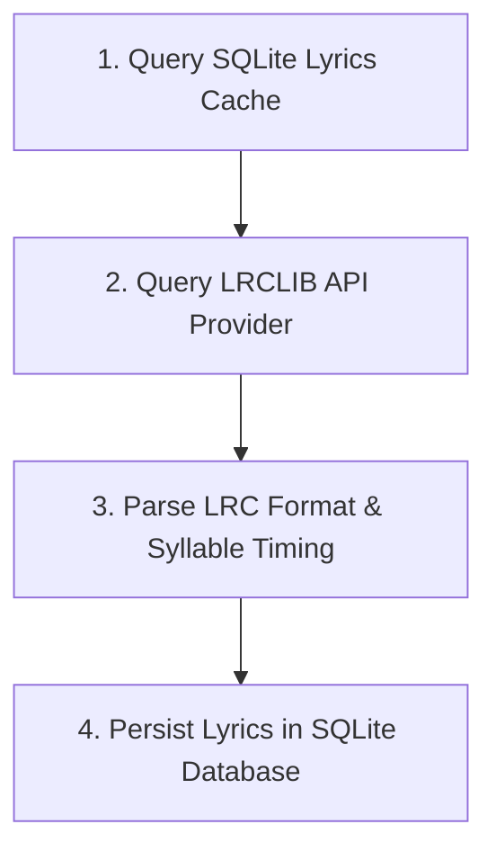
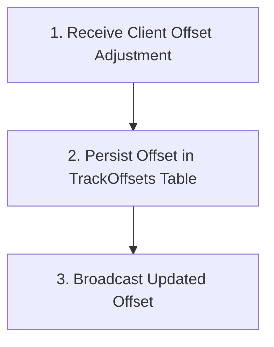

# Synchronized Lyrics Retrieval & SQLite Caching

Orchestrates multi-tiered lyrics retrieval with local SQLite caching, LRCLIB integration with title/artist fuzzy matching, LRC parsing, and per-track latency calibration.

## Domain Rules & Constraints

- **Cache-first strategy: checks local SQLite before requesting external providers**
- **7-day negative cache prevents repeated API spam for instrumental or unlisted songs**
- **LRC parser handles standard timestamps, syllable timings, and offset metadata**
- **Per-track manual latency offsets persist across sessions**

## Key Domain Entities

| Entity | Description |
| :--- | :--- |
| **`SyncedLyrics`** | Core domain entity representing state within Synchronized Lyrics Retrieval & Caching |
| **`LyricLine`** | Core domain entity representing state within Synchronized Lyrics Retrieval & Caching |
| **`CachedLyricsEntity`** | Core domain entity representing state within Synchronized Lyrics Retrieval & Caching |
| **`TrackOffset`** | Core domain entity representing state within Synchronized Lyrics Retrieval & Caching |

---
## Flow: Lyrics Lookup, Retrieval & Caching

Resolves lyrics for a track by probing local cache, querying LRCLIB API with fallback search, parsing LRC content, and persisting results.

- **Entry Point**: `GET /api/lyrics/{trackId}` (http)
- **Complexity**: `complex`

### Step Sequence & Source Locations

| Step | Name | Summary | Source Location |
| :---: | :--- | :--- | :--- |
| 1 | **Query SQLite Lyrics Cache** | Searches SQLite CachedLyrics table for unexpired positive or negative cache entries. | `src/Cantus.Infrastructure/Lyrics/SqliteLyricsCacheRepository.cs#L20-L72` |
| 2 | **Query LRCLIB API Provider** | Calls LRCLIB /api/get by Spotify track ID with fallback to /api/search by title, artist, and album. | `src/Cantus.Infrastructure/Lyrics/LrclibLyricsProvider.cs#L37-L128` |
| 3 | **Parse LRC Format & Syllable Timing** | Decodes LRC timestamp tags [mm:ss.xx] and syllable markers into structured LyricLine objects. | `src/Cantus.Core/Parsers/LrcParser.cs#L8-L164` |
| 4 | **Persist Lyrics in SQLite Database** | Saves raw LRC and parsed status to CachedLyrics table with 30-day expiration. | `src/Cantus.Infrastructure/Lyrics/SqliteLyricsCacheRepository.cs#L94-L194` |

### Execution Flowchart

---
## Flow: Track Latency Offset Calibration

Allows clients to nudge lyric synchronization offsets in ±50ms increments and saves persistent offsets per track.

- **Entry Point**: `PlaybackHub.SetTrackOffset` (http)
- **Complexity**: `moderate`

### Step Sequence & Source Locations

| Step | Name | Summary | Source Location |
| :---: | :--- | :--- | :--- |
| 1 | **Receive Client Offset Adjustment** | Validates incoming track ID and millisecond offset value from SignalR client invocation. | `src/Cantus.Server/Hubs/PlaybackHub.cs#L143-L172` |
| 2 | **Persist Offset in TrackOffsets Table** | Upserts the track's custom offset in SQLite database to apply across all future playbacks. | `src/Cantus.Infrastructure/Lyrics/SqliteLyricsCacheRepository.cs#L209-L237` |
| 3 | **Broadcast Updated Offset** | Emits OnTrackOffsetUpdated SignalR notification to all clients subscribed to the active room. | `src/Cantus.Server/Hubs/PlaybackHub.cs#L165-L171` |

### Execution Flowchart

