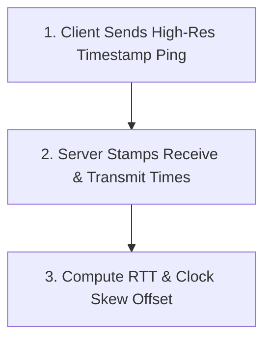

# Client Clock Synchronization & NTP Interpolation

Provides continuous NTP-based sub-millisecond clock synchronization, playback position interpolation, dynamic color scheme extraction from album art, and smooth lyric UI rendering.

## Domain Rules & Constraints

- **Continuous 4-timestamp NTP ping round trips calculate RTT and clock skew**
- **Sub-millisecond interpolation smooths playback progress across network jitter**
- **Adaptive color palette generator extracts dominant hues from cover art**

## Key Domain Entities

| Entity | Description |
| :--- | :--- |
| **`NtpSample`** | Core domain entity representing state within Client Clock Synchronization & Dynamic Rendering |
| **`AppTheme`** | Core domain entity representing state within Client Clock Synchronization & Dynamic Rendering |
| **`LyricLineViewModel`** | Core domain entity representing state within Client Clock Synchronization & Dynamic Rendering |
| **`DiagnosticsDto`** | Core domain entity representing state within Client Clock Synchronization & Dynamic Rendering |

---
## Flow: NTP Clock Skew & Latency Sync

Executes periodic NTP time exchanges between client and server to eliminate clock drift and calculate network latency.

- **Entry Point**: `SignalRPlaybackClient.SyncClockAsync` (cron)
- **Complexity**: `moderate`

### Step Sequence & Source Locations

| Step | Name | Summary | Source Location |
| :---: | :--- | :--- | :--- |
| 1 | **Client Sends High-Res Timestamp Ping** | Records client transmission timestamp (T1) and sends SyncClock request via SignalR. | `src/Cantus.Client/Cantus.Client/Services/SignalRPlaybackClient.cs#L140-L165` |
| 2 | **Server Stamps Receive & Transmit Times** | Attaches server receive timestamp (T2) and transmit timestamp (T3) before replying. | `src/Cantus.Server/Hubs/PlaybackHub.cs#L100-L109` |
| 3 | **Compute RTT & Clock Skew Offset** | Calculates RTT = (T4 - T1) - (T3 - T2) and skew = ((T2 - T1) + (T3 - T4)) / 2 with rolling filter. | `src/Cantus.Client/Cantus.Client/Services/SignalRPlaybackClient.cs#L167-L215` |

### Execution Flowchart

