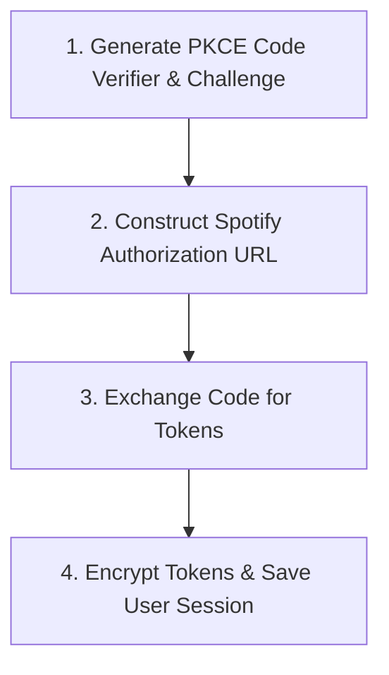

# Spotify PKCE Authentication & Session Management

Handles Spotify OAuth 2.0 PKCE authentication flows, secure token encryption at rest via ASP.NET Core Data Protection, automated token renewal cycles, and user session persistence.

## Domain Rules & Constraints

- **Tokens must be encrypted at rest using ASP.NET Core Data Protection**
- **Automated background refresh occurs before access token expiry**
- **Multi-user session isolation with unique Spotify User ID keys**

## Key Domain Entities

| Entity | Description |
| :--- | :--- |
| **`UserSession`** | Core domain entity representing state within Spotify Authentication & Session Management |
| **`SpotifyAuthTokens`** | Core domain entity representing state within Spotify Authentication & Session Management |
| **`PKCEChallenge`** | Core domain entity representing state within Spotify Authentication & Session Management |

---
## Flow: Spotify PKCE Login & Authorization

End-to-end OAuth PKCE flow generating challenges, redirecting to Spotify consent, exchanging authorization codes, and storing encrypted credentials.

- **Entry Point**: `GET /api/auth/login` (http)
- **Complexity**: `complex`

### Step Sequence & Source Locations

| Step | Name | Summary | Source Location |
| :---: | :--- | :--- | :--- |
| 1 | **Generate PKCE Code Verifier & Challenge** | Creates cryptographically secure random verifier and computes SHA-256 code challenge. | `src/Cantus.Server/Services/PkceHelper.cs#L10-L28` |
| 2 | **Construct Spotify Authorization URL** | Builds Spotify OAuth consent URL with user-read-playback-state scopes and PKCE challenge. | `src/Cantus.Infrastructure/Spotify/SpotifyAuthService.cs#L32-L44` |
| 3 | **Exchange Code for Tokens** | Submits authorization code and verifier to Spotify token endpoint to obtain access and refresh tokens. | `src/Cantus.Infrastructure/Spotify/SpotifyAuthService.cs#L46-L108` |
| 4 | **Encrypt Tokens & Save User Session** | Encrypts refresh tokens with ASP.NET Core Data Protection and writes user profile to SQLite database. | `src/Cantus.Infrastructure/Security/DataProtectionTokenEncryptionService.cs#L15-L34` |

### Execution Flowchart

