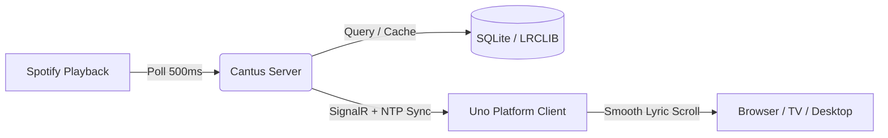

# Cantus Documentation

  <strong>Self-Hosted, Real-Time Synchronized Lyrics Display Platform</strong>

---

## Welcome to Cantus

**Cantus** is an open-source, multi-room synchronized lyrics display system designed to elevate your music listening experience. It continuously tracks your active playback from Spotify, dynamically fetches and caches synchronized LRC lyrics from LRCLIB, filters network clock skew down to the sub-millisecond level, and streams real-time karaoke-style lyric animations to browser and desktop clients.

---

## Core Capabilities

- **Sub-Millisecond Clock Synchronization**: Continuous 4-timestamp NTP ping/pong clock offset estimation and smooth interpolation filters network jitter.
- **Adaptive Polling Engine**: Dynamically shifts polling cadence (500ms when playing, 3s when paused, 10s when idle) and stops background polling when no viewers are connected to conserve Spotify API rate limits.
- **Multi-Tier Lyrics Caching**: Probes local SQLite cache first, falls back to LRCLIB fuzzy search, and maintains a 7-day negative cache for instrumental tracks.
- **Dynamic Cover Art Palette Theming**: Extracts dominant palettes and accent colors from album artwork in real-time.
- **Cross-Platform Uno UI**: Native desktop experience on Windows & Linux (Skia/X11) alongside WebAssembly in modern browsers.
- **Multi-Room Subscriptions**: Support for simultaneous room viewers tuned to different Spotify users.

---

## Documentation Guide

| Section | Description |
| :--- | :--- |
| [**Getting Started**](getting-started/quickstart.md) | Rapid setup guide for developers using .NET 9 and Docker. |
| [**System Architecture**](architecture/overview.md) | Deep dive into the 5-layer system design, ViewModels, and SignalR hub. |
| [**Domain Flows**](domain-flows/index.md) | End-to-end trace of Spotify PKCE auth, polling, NTP sync, and lyrics caching. |
| [**Operator Guide**](operator-guide/self-hosting.md) | Production self-hosting with Docker Compose, Traefik, and Spotify Developer App. |
| [**Configuration Reference**](reference/configuration.md) | Comprehensive reference of environment variables, ports, and options. |
