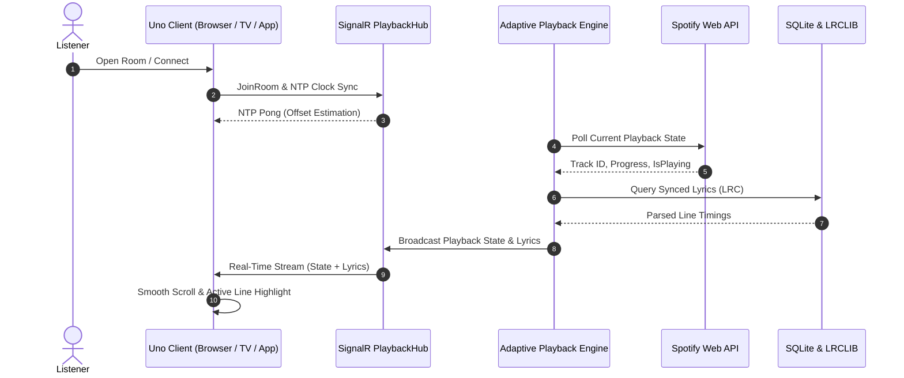

---
hide:
  - navigation
  - toc
---

  <h1>Cantus</h1>
  

    Self-Hosted, Real-Time Synchronized Lyrics Display Platform. 
    Continuous Spotify tracking, sub-millisecond clock sync, and beautiful karaoke-style visual animations.
  

  

    <a href="user-guide/" class="cantus-btn cantus-btn-primary">
      Get Started &rarr;
    </a>
    <a href="operator-guide/self-hosting/" class="cantus-btn cantus-btn-secondary">
      Deploy with Docker
    </a>
    <a href="architecture/overview/" class="cantus-btn cantus-btn-secondary">
      Explore Architecture
    </a>
  

  

    
⚡

    <h3>Sub-Millisecond Clock Sync</h3>
    

      Continuous 4-timestamp NTP clock offset estimation and smooth interpolation filters network jitter to keep lyrics perfectly synchronized with your audio stream.
    

    <a href="architecture/ntp-clock-sync/" class="card-link">Read about NTP Sync &rarr;</a>
  

  

    
🧠

    <h3>Adaptive Polling Engine</h3>
    

      Intelligently modulates Spotify polling frequency (1.5s when playing, 5s when paused, 10s when idle) and sleeps when zero viewers are connected to conserve API rate limits.
    

    <a href="architecture/adaptive-polling/" class="card-link">Learn about Adaptive Polling &rarr;</a>
  

  

    
🎵

    <h3>Multi-Tier Lyrics Caching</h3>
    

      Instant local SQLite resolution, fallback to LRCLIB fuzzy matching, and negative caching for instrumental tracks with zero third-party tracking.
    

    <a href="architecture/lyrics-caching/" class="card-link">Explore Lyrics Caching &rarr;</a>
  

  

    
🎨

    <h3>Dynamic Palette Theming</h3>
    

      Extracts complementary accent colors and ambient gradients from active album artwork in real-time for an immersive listening environment.
    

    <a href="user-guide/theming/" class="card-link">Discover Theming Engine &rarr;</a>
  

  

    
🖥️

    <h3>Cross-Platform Display</h3>
    

      Native desktop application on Linux (Skia/X11) and Windows alongside WebAssembly in modern desktop, tablet, and TV web browsers.
    

    <a href="user-guide/playback-and-display/" class="card-link">View Display Modes &rarr;</a>
  

  

    
🔒

    <h3>Privacy & Self-Hosted</h3>
    

      Complete data ownership. OAuth tokens are encrypted at rest with ASP.NET Core Data Protection, running locally inside a lightweight multi-arch Docker container.
    

    <a href="operator-guide/self-hosting/" class="card-link">Self-Hosting Guide &rarr;</a>
  

---

## System Workflow Overview

---

## Documentation Tracks

  

    <h3>📖 User Guide</h3>
    

      Learn how to link your Spotify account, customize the lyric display, configure fullscreen TV kiosk modes, and calibrate audio latency offsets.
    

    <a href="user-guide/" class="card-link">Go to User Guide &rarr;</a>
  

  

    <h3>🚀 Operator Guide</h3>
    

      Deploy Cantus in your home lab or cloud VM using Docker Compose, setup reverse proxies (Caddy, Nginx, Traefik), and configure Spotify Developer apps.
    

    <a href="operator-guide/" class="card-link">Go to Operator Guide &rarr;</a>
  

  

    <h3>🏗️ Architecture & Concepts</h3>
    

      Deep dive into the 5-layer system design, real-time SignalR hubs, NTP clock synchronization math, and Uno Platform MVVM rendering.
    

    <a href="architecture/overview/" class="card-link">Explore Architecture &rarr;</a>
  

  

    <h3>📚 Technical Reference</h3>
    

      Complete reference manuals for SignalR PlaybackHub real-time protocol, REST Minimal APIs, Docker configuration, and environment variables.
    

    <a href="reference/signalr-api/" class="card-link">View Technical Reference &rarr;</a>
  

