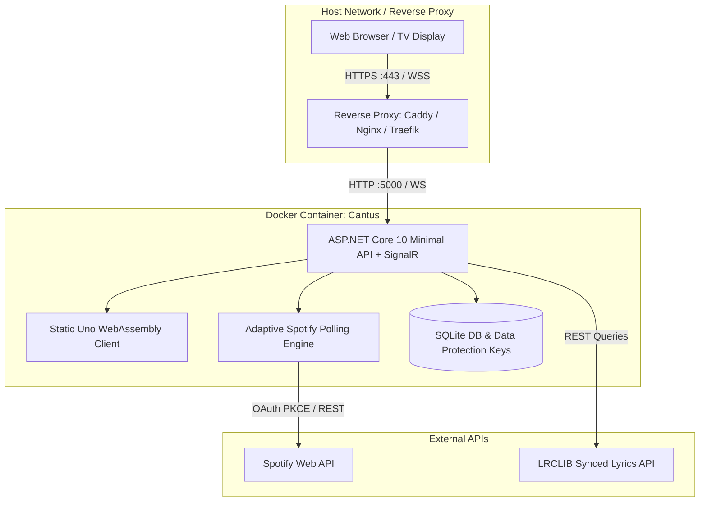

# Operator & Self-Hosting Guide

This section is dedicated to system administrators, homelab enthusiasts, and developers deploying Cantus in production environments.

---

## Deployment Architecture

Cantus is packaged as a lightweight, single-container image supporting both `linux/amd64` (Intel/AMD servers) and `linux/arm64` (Raspberry Pi 4/5, Apple Silicon, AWS Graviton):

---

## Operator Guide Contents

1. [**Self-Hosting with Docker**](self-hosting.md): Docker Compose files, volume mounts, architecture support, and container updates.
2. [**Spotify Developer App Setup**](spotify-setup.md): Step-by-step instructions to create your Spotify OAuth application and set Redirect URIs.
3. [**Reverse Proxy Configuration**](reverse-proxy.md): Production HTTPS and WebSocket upgrade configurations for Caddy, Nginx, and Traefik.
4. [**Troubleshooting & Diagnostics**](troubleshooting.md): Debugging Spotify rate limits, token encryption issues, clock skew, and log outputs.
