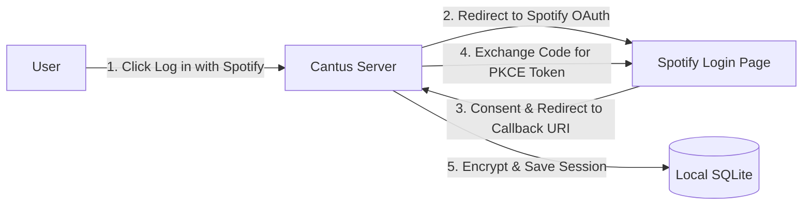

# Spotify Developer App Setup

To allow Cantus to securely communicate with the Spotify Web API and track playback on behalf of users, you must register a free application in the Spotify Developer Dashboard.

---

## 1. Create a Spotify Developer Application

1. Open the [Spotify Developer Dashboard](https://developer.spotify.com/dashboard) and log in with your Spotify account.
2. Click **Create App** (top right).
3. Fill in the application details:
   - **App Name**: `Cantus Lyrics Display` (or your preferred name)
   - **App Description**: `Self-hosted synchronized lyrics display platform`
   - **Redirect URIs**: (See section below)
   - **Which APIs/SDKs are you planning to use?**: Select **Web API**.
4. Check the terms of service checkbox and click **Save**.

---

## 2. Configure Redirect URIs

Cantus uses OAuth 2.0 Authorization Code Flow with **PKCE** (Proof Key for Code Exchange). Spotify requires exact URI matching for callback redirects.

Add your callback URLs to the **Redirect URIs** list in your app settings:

| Environment | Redirect URI |
| :--- | :--- |
| **Localhost (Default)** | `http://localhost:5000/api/auth/spotify/callback` |
| **Loopback IP** | `http://127.0.0.1:5000/api/auth/spotify/callback` |
| **Local Network / LAN** | `http://192.168.1.100:5000/api/auth/spotify/callback` |
| **Production Domain (HTTPS)** | `https://cantus.yourdomain.com/api/auth/spotify/callback` |



> [!IMPORTANT]
> The redirect URI configured in your Spotify Developer Dashboard must **exactly match** `${CANTUS_HOST_URL}/api/auth/spotify/callback` (or `/api/auth/callback`), including protocol (`http://` vs `https://`) and port. You can add multiple redirect URIs in the Spotify dashboard (e.g. both `http://localhost:5000/api/auth/spotify/callback` and `http://127.0.0.1:5000/api/auth/spotify/callback`).

---

## 3. Retrieve Your Client ID

1. In your Spotify Developer App dashboard, click **Settings**.
2. Locate the **Client ID** (a 32-character hexadecimal string).
3. Copy this value into your `.env` file:
   ```ini
   SPOTIFY_CLIENT_ID=abcdef0123456789abcdef0123456789
   ```

> [!NOTE]
> Because Cantus uses the **PKCE** extension, a Client Secret is **not** required or used, ensuring your client secret is never exposed or logged.

---

## 4. User Quotas & Spotify Developer Mode

By default, newly created Spotify applications operate in **Development Mode**:
- You can authenticate up to 25 specific Spotify user accounts.
- To allow family members or friends to use your self-hosted instance, go to your app settings, click **User Management**, and add their Spotify account email addresses.
