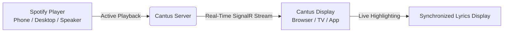

# User Guide Overview

Welcome to the Cantus user guide. Cantus transforms any screen—your desktop monitor, tablet, living room smart TV, or home entertainment center—into a real-time synchronized lyrics display for your Spotify playback.

---

## What is Cantus?

Cantus connects securely to your Spotify account using Spotify's official OAuth 2.0 PKCE protocol. Once authenticated, Cantus continuously monitors your active playback and displays synchronized, line-by-line karaoke lyrics that scroll automatically in time with the music.

---

## Key User Features

- **Multi-Screen & Multi-Room Support**: Multiple displays can subscribe to your Spotify stream simultaneously. Have one display on your desk and another on your living room TV.
- **Micro-Smooth Karaoke Scrolling**: Lyrics scroll smoothly to center the active singing line with gentle animations.
- **Audio Delay Calibration**: Adjust per-track or global millisecond offsets when using Bluetooth or AirPlay speakers with inherent audio latency.
- **Dynamic Artwork Palette Theming**: The background ambient lighting and accent typography dynamically adapt to match the album artwork of the currently playing track.
- **Instrumental Break Detection**: Shows an animated instrumental indicator during lengthy guitar solos or musical interludes.
- **Privacy First**: Your Spotify credentials and playback history stay on your local instance. No telemetry or external tracking.

---

## User Guide Topics

Explore the sections below to get the most out of your Cantus setup:

1. [**Playback & Display Modes**](playback-and-display.md): Fullscreen mode, TV/kiosk setup, responsive layouts, and keyboard shortcuts.
2. [**Timing & Latency Calibration**](timing-and-calibration.md): Fine-tuning millisecond offsets for Bluetooth, AirPlay, and soundbars.
3. [**Dynamic Theming & Visuals**](theming.md): Light/dark themes, album palette generation, and lyric animation states.
