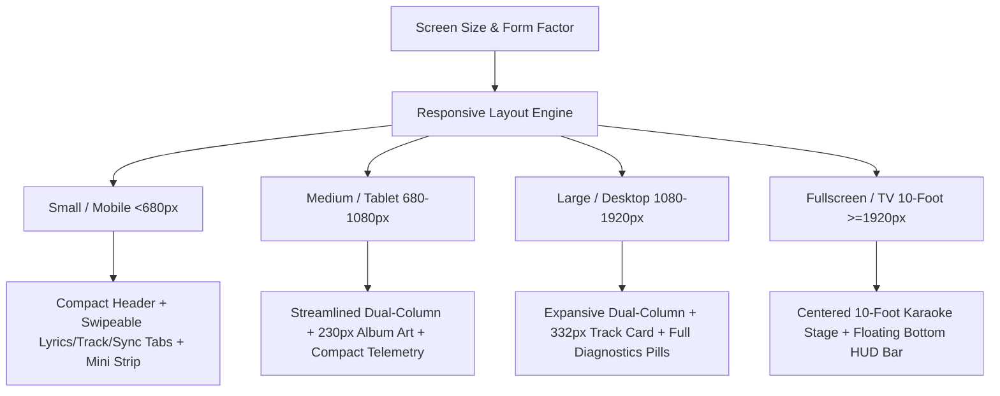

# Playback & Display Modes

Cantus is engineered to deliver a seamless, distraction-free lyrics display across any screen format—from a secondary desktop monitor to a dedicated living room TV kiosk.

---

## Responsive Multi-Form-Factor Layouts

Cantus features a dynamic responsive layout engine that automatically and fluidly adapts to any screen size and aspect ratio:



### Form Factor Specifications

| Form Factor | Breakpoint | Header Mode | Track Card | Lyrics Stage | Navigation |
| :--- | :--- | :--- | :--- | :--- | :--- |
| **Small (Mobile)** | `< 680px` | Minimal + Overflow Flyout | Compact 56px thumbnail strip or dedicated tab | Touch-focused, 24px active line | 3-Tab Bottom Bar (Lyrics / Track / Sync & Info) |
| **Medium (Tablet)** | `680px - 1079px` | Compact status + quick action icons | Side-by-side 290px rail with 230px artwork | Balanced 32px active line | Direct dual-pane or adaptive portrait flow |
| **Large (Desktop)** | `1080px - 1919px` | Full telemetry pills + actions | Expansive 380px card with 332px artwork | Grand 38px active line with smooth auto-scroll | Dual-column workspace |
| **Fullscreen (TV)** | `>= 1920px` / Kiosk | Hidden | Floating minimal 10-foot HUD | Centered 50px high-contrast karaoke lyrics | Keyboard / remote navigation |

---

## Display Environments

### 1. Smart TV & Kiosk Display

To use Cantus as an ambient music visualizer on a TV or dedicated Raspberry Pi display:

1. Open your browser on the smart TV (or launch a Chromium kiosk on Raspberry Pi) to your Cantus URL: `http://<your-server-ip>:5000`.
2. Select your user room from the room selector.
3. Enter fullscreen mode (press <kbd>F11</kbd> or use the TV browser's fullscreen button).
4. The cursor will auto-hide after 3 seconds of inactivity to keep the display clean.

!!! tip "Raspberry Pi & Kiosk Launch"
    If using a Raspberry Pi or wall tablet, launch Chromium in kiosk mode:
    ```bash
    chromium-browser --kiosk --noerrdialogs --disable-infobars http://cantus.local:5000
    ```

---

### 2. Multi-Room & Shared Displays

Cantus supports multi-room subscriptions:
- Each authenticated Spotify account generates a dedicated **Room ID**.
- Any device on your local network (or the internet if reverse-proxied) can navigate to that Room URL.
- When you change tracks on your phone or Spotify desktop app, all connected room displays update simultaneously in real-time.

---

## Keyboard Shortcuts

When the Cantus display window is focused, you can use keyboard shortcuts for quick control:

| Key | Action | Description |
| :--- | :--- | :--- |
| <kbd>F11</kbd> / <kbd>F</kbd> | **Toggle Fullscreen** | Expands viewport to fill the entire monitor. |
| <kbd>[</kbd> | **Delay Lyrics (-50ms)** | Decreases timing offset if lyrics are appearing too early. |
| <kbd>]</kbd> | **Advance Lyrics (+50ms)** | Increases timing offset if lyrics are appearing too late. |
| <kbd>0</kbd> | **Reset Calibration** | Resets custom latency offset for the current track to `0ms`. |
| <kbd>D</kbd> | **Toggle Diagnostics HUD** | Shows real-time NTP roundtrip, clock skew, and SignalR latency. |
| <kbd>T</kbd> | **Toggle Theme Mode** | Cycles between Dynamic Cover Art, Dark Slate, and Light themes. |

---

## Diagnostics HUD

Pressing <kbd>D</kbd> opens the built-in Diagnostics HUD overlay. This displays live performance metrics useful for debugging latency and connection quality:

- **SignalR State**: Connection status (`Connected`, `Reconnecting`, `Disconnected`).
- **NTP Clock Offset**: Current estimated clock skew relative to the server (typically `< 2ms`).
- **Round-Trip Delay (RTT)**: WebSocket ping latency.
- **Active Polling Cadence**: Current server-side poll interval for your Spotify account (e.g. `500ms`).
- **Lyrics Source**: LRCLIB query result status (`Direct Hit`, `Fuzzy Match`, `Cache Hit`, `Instrumental`).
