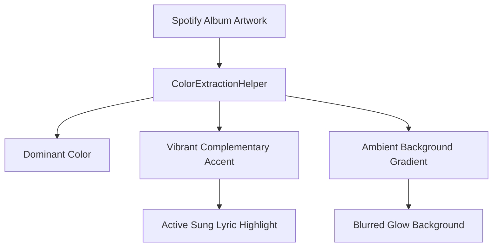
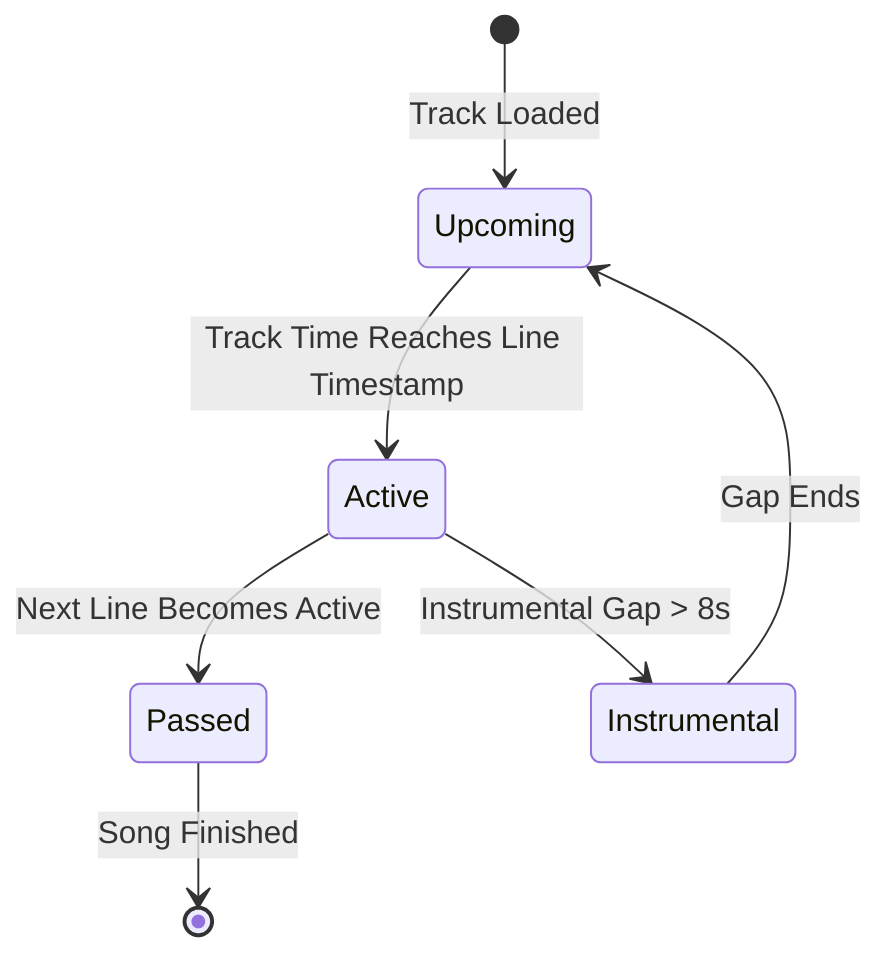

# Dynamic Theming & Visuals

Cantus features a dynamic theming engine that bridges the visual mood of your music with the lyric display.

---

## Dynamic Album Art Palette Extraction

When a new track starts playing, Cantus analyzes the high-resolution album artwork directly in the client and extracts a harmonized color palette:

### Color Extraction Principles

1. **High-Contrast Legibility**: The extracted accent color is dynamically checked against WCAG AA contrast standards. If the artwork is too dark or washed out, the algorithm adjusts lightness and saturation to ensure lyrics remain crisp and easily readable from across the room.
2. **Smooth Cross-Fading**: When changing tracks, the ambient background gradient smoothly transitions over 800ms to avoid abrupt visual flashes.
3. **Cover Art Bloom**: The background features a subtle, hardware-accelerated frosted glass blur of the album artwork, creating an ambient glow.

---

## Available Theme Modes

You can switch between theme modes by pressing <kbd>T</kbd> on your keyboard or selecting the theme menu in the UI:

| Theme Mode | Description | Ideal Use Case |
| :--- | :--- | :--- |
| **Dynamic Palette (Default)** | Adapts colors, glow, and text highlights to match the current album art. | Daily listening, TV living room display, visualizers. |
| **Dark Slate** | Clean, minimalist deep-charcoal background with crisp Spotify green accents. | Dark room viewing, OLED displays, low eye strain. |
| **Clean Light** | Crisp high-contrast light theme with dark typography. | Brightly lit offices or sunlit rooms. |

---

## Lyric Animation States

Each line of synchronized lyrics exists in one of four distinct visual states:

- **Upcoming Lines**: Rendered with 50% opacity in neutral text color, allowing you to read upcoming words without drawing primary visual focus.
- **Active Singing Line**: Rendered with 100% opacity, enlarged font weight, vibrant accent color glow, and centered vertically in the viewport.
- **Passed Lines**: Gently dimmed (30% opacity) and scrolled upwards out of the primary viewport.
- **Instrumental Break**: A soft pulsating icon appears between lines when there is a musical interlude longer than 8 seconds.
