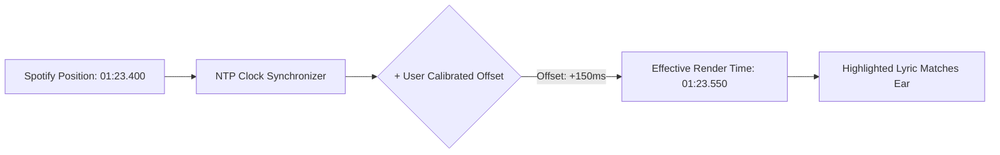

# Timing & Latency Calibration

Different sound systems introduce varying degrees of audio transmission delay. Cantus includes a precision **Latency Calibration Engine** that allows you to shift lyric timing in real time to match what your ears are actually hearing.

---

## Why Audio Latency Occurs

When playing music from Spotify, the Spotify API reports where the playback cursor *should* be according to their servers. However, physical audio output often lags behind:

| Audio Output Device | Typical Delay | Cause |
| :--- | :---: | :--- |
| **Direct Headphone Jack / USB DAC** | `< 10ms` | Negligible hardware buffering. |
| **HDMI ARC / Optical Soundbar** | `30ms – 100ms` | TV audio processing & DSP decoding. |
| **Standard Bluetooth (SBC / AAC)** | `120ms – 250ms` | Wireless packet buffering and encoding. |
| **AirPlay / Chromecast Audio** | `1000ms – 2000ms` | Multi-room streaming buffer sync. |

Without calibration, lyrics would highlight slightly before you hear the vocal line on Bluetooth or AirPlay speakers.

---

## Real-Time Offset Calibration

Cantus allows you to adjust the timing offset on the fly while a song is playing:



### Adjusting Timing via Keyboard

1. Listen to the vocals while watching the highlighted line on screen.
2. If the lyrics highlight **too early** (before you hear the singer):
   - Press <kbd>[</kbd> to decrease offset by `-50ms`.
3. If the lyrics highlight **too late** (after you hear the singer):
   - Press <kbd>]</kbd> to advance offset by `+50ms`.
4. Press <kbd>0</kbd> at any time to reset the offset back to `0ms`.

---

## Per-Track Offset Persistence

Cantus automatically stores your calibrated offset in its SQLite database keyed by the Spotify **Track ID**:

- When the same song plays again in the future, Cantus instantly applies your custom calibrated offset.
- Track-level calibrations do not affect other songs that may have different mastering or timing alignments.

---

## Global Default Offset

If all your listening happens over a specific Bluetooth speaker or AirPlay setup with a constant delay across all tracks, you can set a global offset in your server environment:

```ini
# .env file
CANTUS_DEFAULT_LATENCY_OFFSET_MS=150
```

This base offset will apply automatically to all tracks, while per-track micro-adjustments made in the UI will stack on top of it.
